# Hi 👋, I'm Ankush
### A passionate graphics learner from India

- 🔭 I’m currently working on **fixing my life**
- 🌱 I’m currently learning **Vulkan, DOD, Rust, Modern C++, DSA**
- 📫 How to reach me **ankush3411111@gmail.com**

## Languages and Tools:

#### I have shipped projects with:

#### I am learning:

#### I use:

## Stats:

  
   
  

## More Yapping
Hi! I am Ankush Roy a teen from India. I love mathematics and computers. I aspire to become a Graphics Programmer as it consist of all maths, programming and art. I love customising my workstation exactly the way I like, so I use [my own rice](https://github.com/AnkushRoy-code/dotfiles) of Arch Linux (btw) that consist of i3, Polybar, Rofi, Picom. I use Neovim as my editor for everything and have made a [custom config](https://github.com/AnkushRoy-code/dotfiles/tree/main/.config/nvim) from scratch that I use daily. I also use a modified version of Colemak Mod-DH layout in my custom ergonimic split keyboard called [Splitwave](https://github.com/AnkushRoy-code/SplitWave). I live in the terminal and only use my mouse (MX Master 3S) for browsing the web or other very few GUI applications that I use.

Above all I am trying to become a better person who doesn't show off and is humble....I am trying.

Please check out my other work [here](https://github.com/AnkushRoy-code?tab=repositories) :)
